# Proyecto 3 - Analítica de resultados Saber 11
Repositorio dedicado al Proyecto 3 - Predicción del éxito académico elaborado en el marco del curso 'ᴀɴᴀʟíᴛɪᴄᴀ ᴄᴏᴍᴘᴜᴛᴀᴄɪᴏɴᴀʟ ᴘᴀʀᴀ ʟᴀ ᴛᴏᴍᴀ ᴅᴇ ᴅᴇᴄɪsɪᴏɴᴇs'

## Avance del proyecto

```mermaid
gantt
    title Proyecto 3 - Analítica de resultados Saber 11
    dateFormat  YYYY-MM-DD
    section 💪🏽 Grace - Modelo
    🤔 Definir tema de investigación:2023-10-21 5:00,1h
    section 🐴 Caro - Dashboard + Visualizaciones
    🔰 Creación del repo y planeación de dash:2023-10-17 0:00,1d
    🔍 Primera exploración de datos:2023-10-19 0:00,1d
    🔨 Adaptación de Layout (P2 a P3) - Parte 1:2023-10-21 0:00,36h
```

## Requisitos
- Python 3.6 o superior
- Instalar las dependencias:
    - `dash`
    - `dash_bootstrap_components`
    - `dash_bootstrap_templates`
    - `fontawesome`
    - `gunicorn`
    - `matplotlib`
    - `pandas`
    - `pgmpy`
    - `psycopg2`
    - `pywaffle`

## Estructura del repositorio
- `assets/`: Directorio que contiene los recursos utilizados en la interfaz.
    - `croquis-ANT.png`: Opción 1 de logo para la aplicación. Croquis de Antioquia original.
    - `croquis-ANT2.png`: Opción 2 de logo para la aplicación. Croquis de Antioquia con borde blanco.
    - `croquis-ANT3.png`: Opción 3 de logo para la aplicación. Croquis de Antioquia con bandera.
    - `custom.css`: Archivo que contiene el estilo personalizado de la aplicación.
    - `parameter_options.JSON`: Archivo JSON con las opciones de los menús desplegables.
- `Pages/`: Carpeta que contiene los archivos de las páginas del dashboard.
    - `home.py`: Archivo que contiene el cuerpo de la página de inicio (app v.1.).
    - `visualizations.py`: Archivo que contiene el cuerpo de la página de visualizaciones.	
- `.gitignore`: Archivo que especifica los archivos que no se deben subir al repositorio.
- `app.py`: Código principal de la aplicación.

